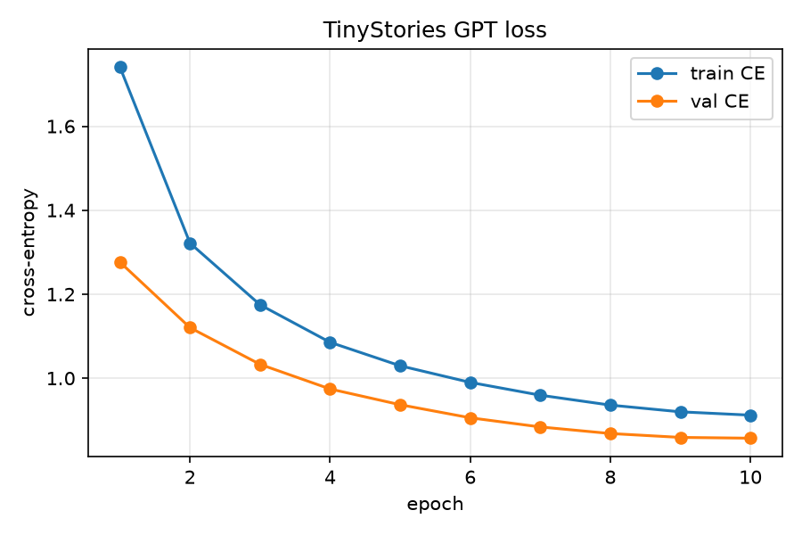
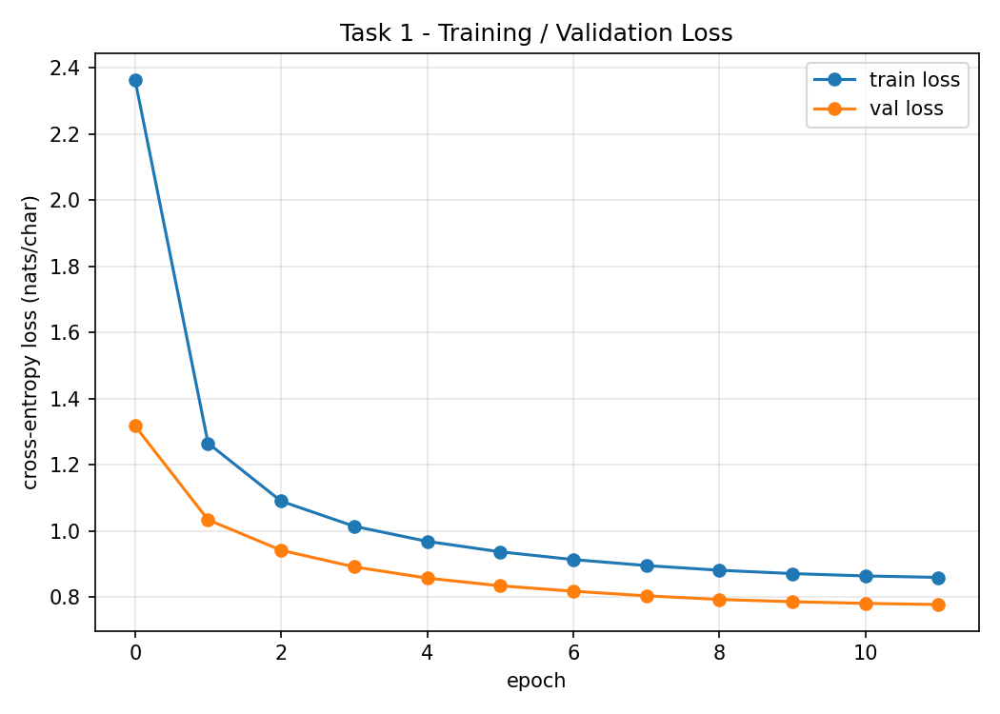
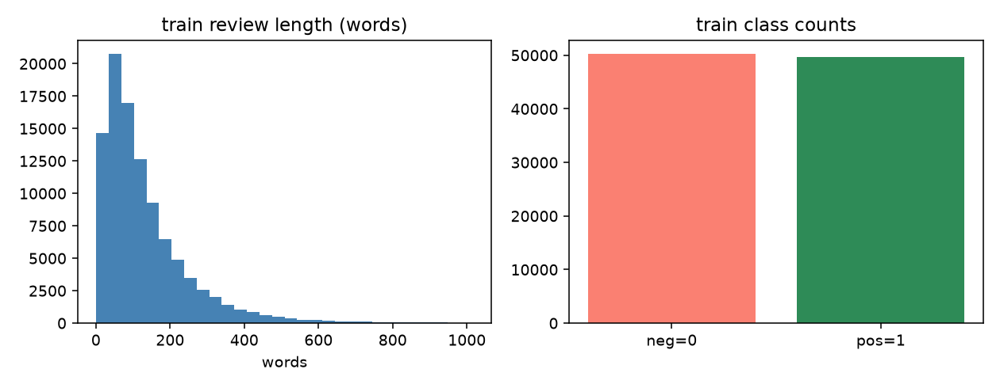
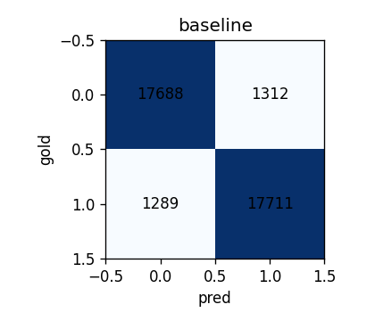
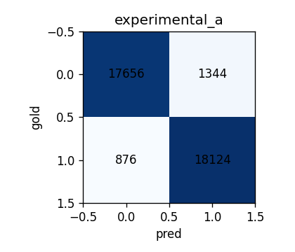
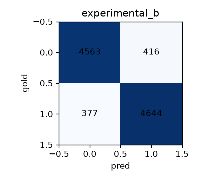
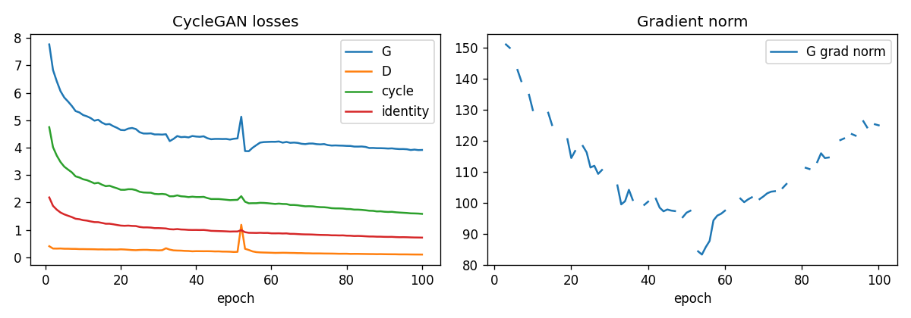
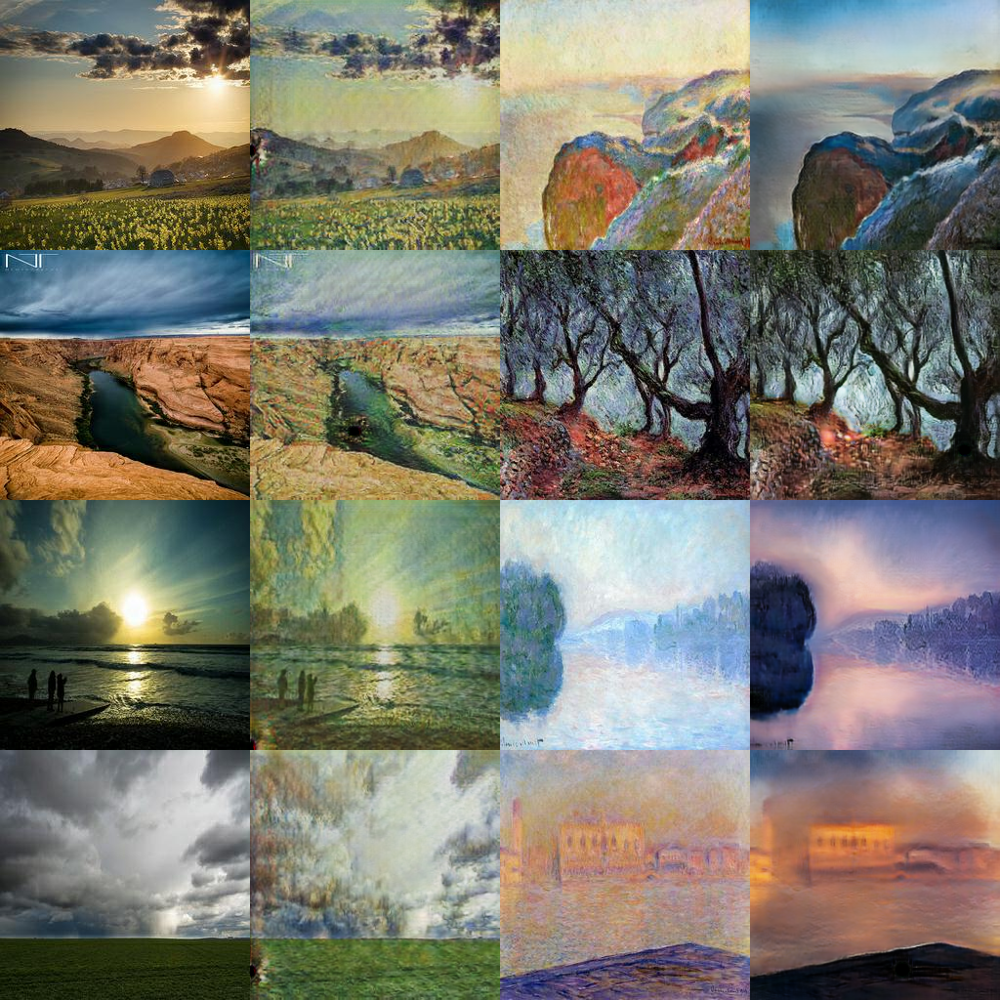
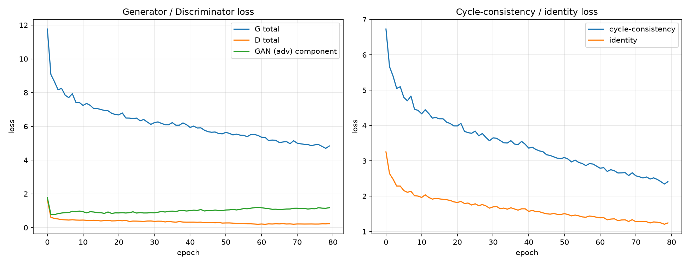

<h1>DATA266 Lab 1</h1>

Team 5

Sneha Singh

Ritika Mukesh Neema

## Abstract

This report covers three tasks, each trained twice. Sneha Singh and Ritika Mukesh Neema each built a character-level GPT on TinyStories, three Yelp polarity classifiers, and a CycleGAN for photo-to-Monet transfer. The models are not copies of each other. On Part 1, Ritika’s validation loss is lower and Sneha’s samples are more varied. On Part 2, Ritika’s BiLSTM leads on the full review set, while Sneha’s mean-pool baseline still leads her own 100k sample. On Part 3, Sneha’s photo-to-Monet FID is 89.99 and her MiFID is 0.403. Ritika’s FID is 123.70. Ritika’s eval script did not compute MiFID. Kaggle scores and the shared human-audit kappa are still open. The repository is https://github.com/snehas-SJSU/Data_266-Lab1.

## Introduction

Each part below has two individual write-ups and then one team comparison. Section A is Sneha’s model, metrics, failures, and hardware. Section B is Ritika’s. Section C puts the two runs side by side. Code for Sneha lives under `sneha_singh/`. Code for Ritika lives under `ritika_mukesh_neema/`. Raw TinyStories and the Monet and photo folders are linked from the README because they are too large for git. Yelp is downloaded by the notebook from Hugging Face.

## What each of us built

| Part | Sneha Singh (her own model) | Ritika Mukesh Neema (her own model) |
|---|---|---|
| 1 — GPT (TinyStories) | 4 layers, emb 256, context 128, 10 epochs, RTX 5090 | 4 layers, emb 128, context 256, 12 epochs, Colab GPU |
| 2 — Yelp polarity | Mean-pool, BiLSTM, TextCNN on a 100k sample, Mac MPS | Mean-pool, BiLSTM, TextCNN on the full 560k set, Colab GPU |
| 3 — CycleGAN | Batch 4, nearest upsample, FID 89.99, MiFID 0.403 | Batch 1, FID 123.70. Her MiFID was not computed |

We share the raw data. The rows above are two separate runs of the same part, not a split of who had to do which part.

---

# Part 1 — GPT from scratch

## 1.A Sneha Singh — individual

I trained a small character-level GPT on TinyStories. The attention code is mine. I did not use `nn.Transformer` or `nn.MultiheadAttention`.

The tokenizer is a simple `char_to_idx` / `idx_to_char` map, not BPE. The model has 4 layers, 4 heads, embedding size 256, and a context of 128 characters. A causal mask stops each position from seeing the future. I tied the token weights the usual way and trained with AdamW. Bias and LayerNorm do not get weight decay.

The reported run is the full one, not the old 2-epoch smoke test. I took my own split from `TinyStories-train.txt`: 100,000 train windows and 10,000 validation windows, seed 670. That text file is 1.79 GB, over GitHub’s 100 MB limit, so it is not in git: https://drive.google.com/drive/folders/12MFVOo6T3QRW3X6THiDkh5svtNgL13W_?usp=share_link

I trained for 10 epochs on an NVIDIA GeForce RTX 5090 with mixed precision. Learning rate was 0.001, with 100 warmup steps and then cosine decay. Batch size was 32. The run took 457 seconds and peaked at about 349 MB. There were no NaN losses. The checkpoint `best.pt` is 12 MB, so it is on git.

Checkpoint id: `task1_llm/sneha_singh/checkpoints/best.pt`. Log: `reproducibility/raw_logs/sneha_singh/task1_llm/train_full.log`.

| Metric | Value |
|---|---|
| Train cross-entropy | 0.912 |
| Val cross-entropy | 0.857 |
| Perplexity | 2.36 |
| Bits per character | 1.236 |
| Generalization gap (val − train) | −0.055 |
| Top-1 next-character accuracy | 0.729 |
| Distinct-1 / 2 / 3 | 0.225 / 0.655 / 0.856 |
| Repeated 4-gram rate | 0.120 |
| Max gradient norm / NaN count | 5.42 / 0 |
| Parameters | 3.25M |
| Train tokens/sec | 280,325 |
| Generation tokens/sec | 409 |
| Peak memory / train time | 349 MB / 457 s |

The loss falls smoothly and the validation curve stays close to the training curve. That is what I wanted from 10 epochs on this size of model.

The prompt I used for samples was “some changes. She added some nice colors”.

Greedy decoding writes a readable start, then gets stuck: “You are very happy. You are very happy.” It also doubles a word, “them them”. Temperature 0.8 does not loop as hard, but the story wanders from colors to a box, a door, and then a tree. I expected some of this. The model only sees 128 characters at a time, and it has no idea where a word ends. The three cases are written up in `task1_llm/sneha_singh/failure_analysis.md`.

## 1.B Ritika Mukesh Neema — individual

Ritika also wrote the attention herself. She did not use `nn.Transformer` or `nn.MultiheadAttention`. Her model is smaller: 4 layers, 4 heads, embedding size 128, and a context of 256 characters. The tokenizer is character-level, built only from her training text, with a vocab of 221. She drew her own 100,000 / 10,000 windows from the full TinyStories train file, seed 6638. The checkpoint is `task1_llm/ritika_mukesh_neema/checkpoints/ckpt_final.pt`.

She trained for 12 epochs, batch 64, learning rate 0.0003, with linear warmup and cosine decay. Weight decay was 0.01 and gradients were clipped at 1.0. The run was on a Colab GPU and took 1,727 seconds, peaking at 1,749 MB. There were no NaN losses.

| Metric | Train | Val |
|---|---|---|
| Cross-entropy | 0.860 | 0.778 |
| Perplexity | 2.36 | 2.18 |
| Bits per character | 1.240 | 1.122 |
| Generalization gap | | −0.082 |
| Top-1 next-character accuracy | | 0.755 |
| Distinct-1 / 2 / 3 | | 0.008 / 0.054 / 0.137 |
| Repeated 4-gram rate | | 0.206 |
| Max gradient norm / NaN count | | 4.99 / 0 |
| Parameters | | 0.88M |
| Train tokens/sec | | 177,917 |
| Generation tokens/sec | | 239 |
| Peak memory / train time | | 1,749 MB / 1,727 s |

Her three failure cases are in `task1_llm/ritika_mukesh_neema/failure_analysis.md`.

Greedy decoding collapses. All 10 greedy samples are the same story, and it loops: “You are very happy. You are very happy.” Temperature sampling writes a word that is not English, “designt”, and the object drifts from a box to a red ball to a bird. A fourth issue is the script, not the model: generation does not stop at the story-boundary token, so a second story gets stuck on the end.

## 1.C Team comparison

Ritika’s validation loss is lower. Sneha’s samples are more varied. Both greedy decoders fall into the same “You are very happy” loop.

| | Sneha | Ritika |
|---|---|---|
| Architecture | 4 layers, 4 heads, emb 256, context 128, char tokenizer, causal mask | 4 layers, 4 heads, emb 128, context 256, char tokenizer, causal mask |
| Hyperparameters | 10 epochs, batch 32, lr 0.001, warmup 100, seed 670, AdamW | 12 epochs, batch 64, lr 0.0003, warmup + cosine, seed 6638, clip 1.0 |
| Train / val CE | 0.912 / 0.857 | 0.860 / 0.778 |
| Perplexity / bits per char | 2.36 / 1.236 | 2.18 / 1.122 |
| Gen. gap / top-1 acc | −0.055 / 0.729 | −0.082 / 0.755 |
| Distinct-1/2/3 | 0.225 / 0.655 / 0.856 | 0.008 / 0.054 / 0.137 |
| Repeated 4-gram / NaNs | 0.120 / 0 | 0.206 / 0 |
| Params / time / peak MB | 3.25M / 457 s / 349 | 0.88M / 1,727 s / 1,749 |
| Checkpoint | `task1_llm/sneha_singh/checkpoints/best.pt` | `task1_llm/ritika_mukesh_neema/checkpoints/ckpt_final.pt` |
| Log | `reproducibility/raw_logs/sneha_singh/task1_llm/train_full.log` | her raw log under `reproducibility/raw_logs/ritika_mukesh_neema/` |

Ritika’s strength is the lower validation loss, 0.778 against Sneha’s 0.857, on a smaller model. Sneha’s strength is variety: distinct-1 is 0.225 against Ritika’s 0.008. The shared weakness is greedy decoding. Both of us loop on “You are very happy.” The limitation is that the runs are not the same model: embedding size, context length, and the machine all differ, so the loss gap is not a pure architecture contest. Next we would add a repetition penalty at decode time, and stop generation when the story-boundary token appears.

---

# Part 2 — Yelp polarity

## 2.A Sneha Singh — individual

This is Yelp polarity, not IMDB. I learned the embeddings from scratch. I did not use a pretrained language model.

The Yelp files are not on Drive and not in git. The notebook downloads `fancyzhx/yelp_polarity` from Hugging Face when the run starts, so there is nothing for me to upload.

I wanted one simple model and two that can use word order, so a strong baseline would be obvious if the fancier models did not beat it.

1. **Baseline.** Mean pool over the embeddings, then a linear layer.
2. **BiLSTM.** Reads the review in both directions, so negation and longer sentences have a chance.
3. **TextCNN.** Filters of width 3, 4, and 5, meant to catch short phrases like “not good”.

I lowercased, stripped punctuation, removed stopwords, and lemmatized. The vocabulary comes from the training text only. I sampled 100,000 training reviews. Eleven were empty after cleaning, so the split is 99,989 / 10,000 / 10,000. Five epochs, batch 64, embedding size 100, maximum length 128. All three models ran on my Mac: Apple M4, 16 GB unified memory, MPS. The CUDA peak-memory counter stays 0 on MPS, so I left that field at 0.0 instead of inventing a number.

| Model | Acc | Macro-F1 | ROC-AUC | MCC | Brier | ECE | Time |
|---|---|---|---|---|---|---|---|
| Baseline | 0.923 | 0.923 | 0.973 | 0.845 | 0.059 | 0.011 | 114 s |
| BiLSTM | 0.918 | 0.918 | 0.975 | 0.837 | 0.060 | 0.017 | 1706 s |
| TextCNN | 0.921 | 0.921 | 0.975 | 0.841 | 0.061 | 0.024 | 108 s |

The baseline still has the best macro-F1. McNemar against the baseline is p = 0.091 for the BiLSTM and p = 0.424 for the TextCNN. On this 10k test set I cannot say the other two are clearly different. Short reviews are a bit easier than long ones for every model. Long-review macro-F1 is 0.917, 0.912, and 0.915 for baseline, BiLSTM, and TextCNN.

The length and class balance of the sample:

Confusion matrices on the test set:

I read 20 baseline mistakes. Five confident false positives, five confident false negatives, five near the decision threshold, and five long-review misses. The full list, with an error type and a testable fix on each row, is in `task2_sentiment/sneha_singh/failure_analysis.md`. Four of them:

- Confident false positive, gold negative: “food always good”.
- Confident false negative, gold positive: “not restaurant closed”.
- Near the threshold: “disappointed went early morning … coffee warm not good”.
- Long review, gold positive, predicted negative: a long airport note that mixes praise with complaints.

The ones that show up most are tiny blurbs the model treats as positive, negation or mixed wording, and long reviews where the stars and the sentences pull apart.

This is 100k reviews out of about 560k, not the whole Yelp train file. Cutting reviews at 128 tokens hurts the long ones. I kept negation words, and mixed reviews are still hard.

## 2.B Ritika Mukesh Neema — individual

Ritika trained the same three families, with embeddings learned from scratch. Her baseline is a mean pool plus a linear layer. Her BiLSTM is there so negation can depend on word order. Her TextCNN uses filter widths 3, 4, and 5 with global max-pool. She lowercased, stripped punctuation and HTML, removed stopwords, and used Porter stemming instead of lemmatization. She trained on the full Yelp polarity set, about 560,000 reviews, on a Colab GPU. Checkpoints are `task2_sentiment/ritika_mukesh_neema/checkpoints/baseline.pt`, `bilstm.pt`, and `textcnn.pt`. She does not have confusion-matrix images in the repo. The numbers below are from her `metrics_report.csv`.

| Model | Acc | Macro-F1 | ROC-AUC | PR-AUC | MCC | Brier | ECE | Time | Peak MB |
|---|---|---|---|---|---|---|---|---|---|
| Baseline | 0.922 | 0.922 | 0.974 | 0.973 | 0.843 | 0.059 | 0.007 | 125 s | 2,123 |
| BiLSTM | 0.934 | 0.934 | 0.982 | 0.982 | 0.868 | 0.051 | 0.025 | 798 s | 2,274 |
| TextCNN | 0.926 | 0.926 | 0.979 | 0.979 | 0.852 | 0.055 | 0.021 | 267 s | 2,450 |

Her BiLSTM is the best of her three. McNemar against her baseline is p < 0.001 for the BiLSTM and p = 0.00022 for the TextCNN, so on her test set both sequence models beat the mean pool. She reviewed 20 TextCNN mistakes in `task2_sentiment/ritika_mukesh_neema/failure_analysis.md`. The ones that show up are sarcasm (“Is there REALLY even a Leonard…”), a French review the English stemmer cannot handle, and a positive review that opens with “Cox sucks” before it turns around.

## 2.C Team comparison

Same three model families, not the same experiment. Ritika’s BiLSTM leads on the full 560k set. Sneha’s mean-pool baseline still leads on the 100k sample.

| | Sneha baseline | Sneha BiLSTM | Sneha TextCNN | Ritika baseline | Ritika BiLSTM | Ritika TextCNN |
|---|---|---|---|---|---|---|
| Architecture | Mean-pool + linear | BiLSTM | CNN widths 3, 4, 5 | Mean-pool + linear | BiLSTM | CNN widths 3, 4, 5 |
| Data / prep | 100k sample, lemmatize, max len 128 | same | same | full 560k, Porter stem, max len 200 | same | same |
| Hardware | Apple M4 MPS | same | same | Colab GPU | same | same |
| Accuracy | 0.923 | 0.918 | 0.921 | 0.922 | 0.934 | 0.926 |
| Macro-F1 | 0.923 | 0.918 | 0.921 | 0.922 | 0.934 | 0.926 |
| ROC-AUC / PR-AUC | 0.973 / 0.973 | 0.975 / 0.975 | 0.975 / 0.975 | 0.974 / 0.973 | 0.982 / 0.982 | 0.979 / 0.979 |
| MCC / Brier / ECE | 0.845 / 0.059 / 0.011 | 0.837 / 0.060 / 0.017 | 0.841 / 0.061 / 0.024 | 0.843 / 0.059 / 0.007 | 0.868 / 0.051 / 0.025 | 0.852 / 0.055 / 0.021 |
| McNemar p vs own baseline | — | 0.091 | 0.424 | — | < 0.001 | 0.00022 |
| Params / time / peak MB | 4.76M / 114 s / 0.0 | 4.85M / 1706 s / 0.0 | 4.84M / 108 s / 0.0 | 3.00M / 125 s / 2,123 | 3.24M / 798 s / 2,274 | 3.12M / 267 s / 2,450 |
| Checkpoint | `baseline_full.pt` | `experimental_a_full.pt` | `experimental_b_full.pt` | `baseline.pt` | `bilstm.pt` | `textcnn.pt` |

Ritika’s strength is that word order helps: her BiLSTM reaches 0.934 accuracy on the full 560k set, and McNemar says that is not chance. Sneha’s strength is a fast baseline that still leads her own two sequence models on the 100k sample. The shared weakness is sarcasm, mixed reviews, and negation. The limitation is the data size. Sneha used 100k reviews and Ritika used about 560k, so her BiLSTM win is not yet an architecture result. Next we would rerun Sneha’s three models on the full training file. Sneha’s peak-memory field stays 0.0 because MPS does not fill the CUDA counter.

---

# Part 3 — CycleGAN, photo to Monet

## 3.A Sneha Singh — individual

I trained an unpaired CycleGAN. The Kaggle direction is photo to Monet. The generators are mine. I did not use a pretrained model to make the images. Inception and the other nets in the eval script are only for measuring.

Each generator is a ResNet with 9 blocks at 256×256, reflection padding, instance norm, and a tanh output. Upsampling is nearest-neighbor times two, then a stride-1 convolution, not a transposed convolution. Each discriminator is a PatchGAN trained with least-squares loss. The losses are adversarial, cycle L1 with λ = 10, and identity at half of that. Real labels are smoothed to 0.9. An image pool of 50 feeds the discriminator. Batch size is 4. I trained 40 epochs at a constant learning rate and 40 more with decay, and each epoch resamples about 800 photos. The shorter Monet loader is cycled so those photos actually get used. Scoring uses all 7,038 photos in the photo-to-Monet direction and all 300 Monet paintings in the other direction.

Training was on a CUDA GPU with mixed precision. It took about 4.3 hours and peaked near 6568 MB. The log records `device=cuda` and does not print the GPU name. `best.pt` is 107.9 MB, over GitHub’s 100 MB limit, so it is not in git: https://drive.google.com/drive/folders/12AgM95RbZAQUyouH7sukM9nu_rVTD3C9?usp=share_link

The Monet and photo folders are in one Drive folder: https://drive.google.com/drive/folders/1BXYfhW8uZ6umK1TZFW8Un62mZVK72L7Y?usp=share_link

| Direction | FID | KID | MiFID | LPIPS | Content cosine | Cycle L1 |
|---|---|---|---|---|---|---|
| Photo → Monet | 89.99 | 0.018 | 0.403 | 0.452 | 0.532 | 0.112 |
| Monet → photo | 92.23 | 0.030 | 0.423 | 0.365 | 0.586 | 0.103 |

FID is the Fréchet distance between Inception features of the generated images and the real target images. MiFID here is the average cosine distance of those features after an equal subsample. Lower is better on both. My local combined score for the Kaggle direction is (89.99 + 0.403) / 2 = 45.20. The same two numbers are in `task3_gan/sneha_singh/submission.csv`. I have not uploaded that file yet, so public score, private score, and rank are still empty.

Losses fell across the 80 epochs. The discriminator loss ended near 0.17, which is low. The generator is not winning that fight, and I think that is why the brush texture gets noisy.

The grid is four photos, the Monet version of each, four real Monets, and the photo version of those.

What I see in that grid, and in the 30 images I audited: the layout of the photo usually survives. Skies and water pick up a grainy, repeated dab texture. Some colors wash out. A few Monet-to-photo frames go soft or pick up a dark blob. I did not mark any of my 30 as a copied training Monet. My rough averages on the sheet were style 1.4, content 1.7, artifacts 1.4, on a 0–2 scale where higher means worse. The sheet is `task3_gan/sneha_singh/outputs/human_audit/audit_30.csv`. Agreement with Ritika is not computed yet, because she has not scored the same 30.

## 3.B Ritika Mukesh Neema — individual

Ritika trained her own CycleGAN: two ResNet generators with 9 blocks, instance norm, and reflection padding, plus two 70×70 PatchGAN discriminators. She used least-squares adversarial loss, cycle L1 with λ = 10, identity loss with λ = 5, and an image pool of 50. Batch size was 1. She trained 40 epochs at a constant learning rate and 40 with decay, on an NVIDIA RTX 5090. The run took 1,660 seconds and peaked at 1,645 MB. There were no NaN losses. Her photo-to-Monet direction is the one she labels B2A. She did not compute MiFID. Cycle L1, LPIPS, and content cosine are on 100 images, not the full photo set. `ckpt_final.pt` is 107.9 MB, so it is not in git: https://drive.google.com/file/d/1Wlu22EKbp4QATijRbNBbDOFFGHLHUiNj/view

| Direction | FID | KID | Precision | Recall | Cycle L1 | LPIPS | Content cosine |
|---|---|---|---|---|---|---|---|
| Photo → Monet (her B2A) | 123.70 | 0.027 | 0.327 | 0.570 | 0.126 | 0.337 | 0.775 |
| Monet → photo (her A2B) | 120.72 | 0.040 | 0.613 | 0.207 | 0.109 | 0.405 | 0.873 |

Final generator loss was 4.84, discriminator loss 0.23, cycle loss 2.41, identity loss 1.24. Mean gradient norm was 57, max 315, NaN count 0. About 28.3 million parameters, 14.5 images/sec.

Her `submission.csv` is still only the header. Her human-audit folder is empty, so she has not scored the shared 30 images and there is no kappa yet.

## 3.C Team comparison

On photo to Monet, Sneha’s FID is 89.99 and her MiFID is 0.403. Ritika’s FID is 123.70. Lower is better, so Sneha’s set is the stronger local score. Only Ritika’s MiFID is missing. Sneha’s is in `submission.csv`.

| | Sneha photo → Monet | Sneha Monet → photo | Ritika photo → Monet | Ritika Monet → photo |
|---|---|---|---|---|
| Architecture | ResNet-9, nearest upsample, PatchGAN, LSGAN, λ_cycle 10, identity 5, labels 0.9 | same model | ResNet-9, PatchGAN, LSGAN, λ_cycle 10, identity 5, batch 1 | same model |
| Hyperparameters | 40 + 40 epochs, batch 4, ~800 photos/epoch, pool 50 | same run | 40 + 40 epochs, batch 1, pool 50, lr 0.0002 | same run |
| FID / KID / MiFID | 89.99 / 0.018 / 0.403 | 92.23 / 0.030 / 0.423 | 123.70 / 0.027 / not computed | 120.72 / 0.040 / not computed |
| Precision / recall | 0.540 / 0.293 | 0.660 / 0.089 | 0.327 / 0.570 | 0.613 / 0.207 |
| Cycle L1 / LPIPS / content cos | 0.112 / 0.452 / 0.532 (full set) | 0.103 / 0.365 / 0.586 | 0.126 / 0.337 / 0.775 (100 images) | 0.109 / 0.405 / 0.873 |
| G / D / cycle / identity | 4.574 / 0.168 / 2.174 / 1.097 | same training run | 4.835 / 0.227 / 2.412 / 1.244 | same training run |
| Grad norm / NaNs | 112.8 / 0 | same | mean 57, max 315 / 0 | same |
| Params / time / images/sec / peak MB | 28.3M / 15,342 s / 8.34 / 6,568 | same | 28.3M / 1,660 s / 14.5 / 1,645 | same |
| Local (FID + MiFID) / 2 | 45.20 | 46.33 | Ritika did not compute MiFID | Ritika did not compute MiFID |
| Kaggle public / private / rank | not uploaded yet | | not uploaded yet | |
| Human audit / κ | style 1.4, content 1.7, artifacts 1.4. κ not computed | | audit folder empty | |
| Checkpoint | https://drive.google.com/drive/folders/12AgM95RbZAQUyouH7sukM9nu_rVTD3C9?usp=share_link | | https://drive.google.com/file/d/1Wlu22EKbp4QATijRbNBbDOFFGHLHUiNj/view | |

Sneha’s strength on the Kaggle direction is the lower FID, 89.99 against Ritika’s 123.70. Ritika’s run is the faster one, about 28 minutes against about 4.3 hours, at batch size 1. The weakness on Sneha’s side is a discriminator loss that ended near 0.17, which shows up as grain in the brush texture. The limitation is that the two evals are not identical: Ritika did not compute MiFID, and her cycle scores use 100 images while Sneha’s use the full sets. Next we upload Sneha’s `submission.csv`, and both of us score the same 30 images so kappa can be filled in. Neither public score is in yet.

---

# What is still open

1. Upload Sneha’s `task3_gan/sneha_singh/submission.csv` to Kaggle for `PairProgramming_Team_5`, then paste the public score, private score, and rank here.
2. Both of us score the same 30 images and add Cohen’s kappa. Ritika’s audit folder is still empty.

The plots in this file are the png files already stored under each task folder. They are not copied again into `report/`.

## Papers

Vaswani et al., Attention Is All You Need (2017). https://arxiv.org/abs/1706.03762. The causal multi-head attention in Part 1 follows that design, written by hand.

Eldan and Li, TinyStories (2023). https://arxiv.org/abs/2305.07759. Part 1 is trained on that dataset.

Zhu et al., Unpaired Image-to-Image Translation using Cycle-Consistent Adversarial Networks (2017). https://arxiv.org/abs/1703.10593. Part 3 is that CycleGAN setup: two generators, two discriminators, cycle loss, and identity loss.
