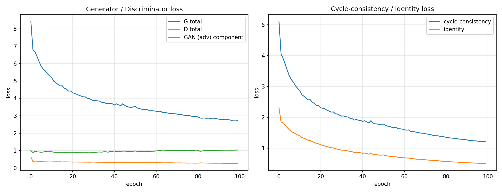

# Experiment: wider generator (80 filters) — not submitted

Same code and settings as the submitted v2 run (`src/config.json`) with two command-line changes:
`--ngf 80 --n_epochs_decay 50 --score_last 25` (generator base filters 64 → 80; 100 epochs = 50 + 50 decay; last 25
epochs scored with the TA notebook, raw and EMA weights → 50 candidates). Colab NVIDIA A100, seed 6638.

Command:
`python train.py --ngf 80 --n_epochs_decay 50 --score_last 25 --ckpt_dir <Drive>/ritika_v2_ngf80/checkpoints --out_dir <Drive>/ritika_v2_ngf80/outputs`

Files here are the run's own outputs, unedited: `checkpoint_scores.csv`, `train_metrics.json`, `train_log.jsonl`,
`loss_curves.png`. Checkpoints were not kept in the repo (not used).

| | 64 filters (submitted) | 80 filters |
|---|---|---|
| Best single score (TA method, training-time) | **48.0133** (epoch 110 raw) | 48.5916 (epoch 96 raw) |
| Best per-direction combo | **47.7980** | 48.5472 |
| Best photo→Monet / Monet→photo FID | **93.91 / 96.47** | 95.25 / 98.12 |
| Final G / D / cycle / identity loss | 2.946 / 0.263 / 1.342 / 0.549 | 2.742 / 0.270 / 1.206 / 0.504 |
| Parameters | 28,285,832 | 41,071,240 |
| Epochs / training time | 125 / 16,310 s | 100 / 16,614 s |
| Images/s, peak GPU memory | 24.5, 17,368 MB | 19.3, 26,918 MB |
| NaN / Inf | 0 | 0 |

Result: lower training losses, but worse FID in both directions — see `failure_analysis.md` (Case 7).
The two runs also differ in schedule length (125 vs 100 epochs), so this is not a pure width comparison.
