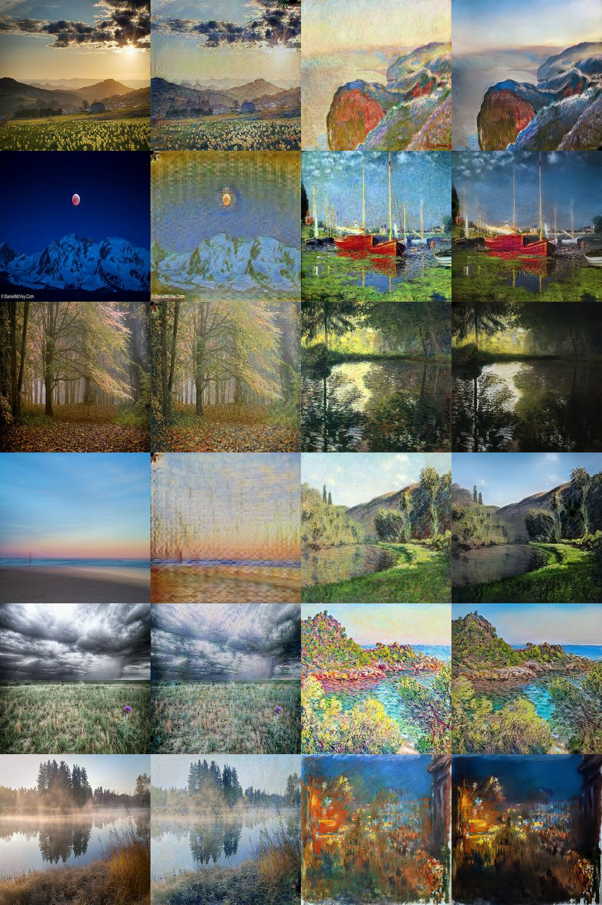

# Task 3 — Results: CycleGAN Monet ↔ Photo Style Transfer (v2)

**Author:** Ritika Mukesh Neema

**Submitted checkpoint:** `checkpoints/best.pt` — epoch 110 of the v2 run, raw (non-EMA) weights.
**Official score (TA evaluation script, `evaluate_local.py`):** FID **95.6037**, MiFID **0.4054** → score (FID + MiFID) / 2 = **48.0046** (Kaggle leaderboard shows −48.0046).

Numbers on this page come from these files (none are hand-edited):
`outputs/train_metrics.json`, `outputs/train_log.jsonl` (raw per-step log), `outputs/checkpoint_scores.csv`,
`outputs/loss_curves.png`, `submission.csv`, `full_metrics_report.csv` / `src/full_metrics.json`,
`outputs/console_generate.log`, `outputs/console_evaluate_local.log`, `outputs/console_full_metrics.log`.

## What changed from v1, and why

The v1 run (archived in `outputs/history_v1/`) trained for 80 epochs of only 300 images each. v2 keeps the same
CycleGAN design and fixes what held v1 back:

| | v1 | v2 | Why |
|---|---|---|---|
| Images per epoch | 300 (one pass over the Monet set) | 3,200 (`steps_per_epoch` 800 × batch 4) | v1 saw only 24,000 images per domain in total; v2 sees 400,000 |
| Epochs | 80 (40 + 40 decay) | 125 (50 constant + 75 linear decay) | best checkpoints appear late in the decay phase |
| Batch size | 1 | 4 | more stable updates, better GPU use |
| Generator decoder | transposed convolutions | nearest-neighbour resize + 3×3 conv (`--upsample nearest`) | removes checkerboard artifacts |
| Discriminator augmentation | none | DiffAugment: color, translation, cutout (`augment.py`) | only 300 Monets: stops D_A memorising them |
| Real label | 1.0 | 0.9 (one-sided smoothing) | keeps the discriminators from becoming over-confident |
| Gradient clipping | max norm 10 | off (`grad_clip` 0) | v1's mean gradient norm (57, G + D) was far above the threshold of 10 |
| EMA of generator weights | no | yes, decay 0.999 (`utils.EMA`) | raw and EMA weights are both scored |
| Mixed precision | no | yes (AMP) | faster training, lower memory |
| Checkpoint selection | final epoch | last 30 epochs scored with the TA's notebook, best kept | picks the best epoch on the official metric |
| Saved JPEG quality | 75 (torchvision default) | 95 | fewer compression artifacts in the evaluated images |
| Resume / thermal guard | weights only | full state every epoch (`checkpoints/last.pt`), optional GPU temperature pause | safe on Colab disconnects and laptop runs |

## Architecture

- **Generators** `G_A2B` (Monet → photo) and `G_B2A` (photo → Monet): ResNet-9, 64 base filters, reflection padding,
  instance normalization, two stride-2 downsampling convs, 9 residual blocks, two upsampling stages
  (nearest ×2 + 3×3 conv), tanh output. 11,378,179 parameters each.
- **Discriminators** `D_A` (real vs fake Monet) and `D_B` (real vs fake photo): 70×70 PatchGAN, C64-C128-C256-C512,
  no norm on the first layer. 2,764,737 parameters each.
- **Total:** 28,285,832 parameters. No pretrained weights in any generator or discriminator.

## Hyperparameter justification

| Choice | Value | Justification |
|---|---|---|
| Generator depth / width | ResNet-9, 64 filters | 9 residual blocks is the CycleGAN design for 256×256 images (6 is for 128×128); 64 filters is the standard width and gives each generator 11.4M parameters |
| Upsampling | nearest ×2 + 3×3 conv | stride-2 transposed convolutions leave checkerboard patterns; resize-convolution avoids them at the same parameter count |
| Discriminator | 70×70 PatchGAN | judges local texture patches, which is where Monet's style lives; keeps the discriminator small (2.8M parameters) |
| Adversarial loss | least-squares (MSE) | more stable gradients than the original cross-entropy GAN loss |
| Cycle weight λ | 10 | the CycleGAN paper value; the cycle loss is what keeps the content when the data is unpaired |
| Identity weight | 5 (0.5 × λ) | paper value; stops the generators from shifting colours of images already in the target style |
| Learning rate / Adam betas | 2e-4, (0.5, 0.999) | standard GAN settings; β1 0.5 reduces momentum oscillation between G and D |
| Schedule | 50 constant + 75 linear decay | most of the gain comes while the learning rate decays, so the decay phase is the longer one |
| Batch / steps per epoch | 4 / 800 | 3,200 images per epoch so the photo domain is well covered; batch 4 fits easily with AMP |
| DiffAugment | color, translation, cutout | with only 300 Monets the discriminator overfits quickly; augmenting every image it sees prevents that |
| Real label | 0.9 | one-sided label smoothing keeps the discriminator from becoming over-confident |
| Image pool | 50 | paper value; the discriminator also sees older fakes, which damps oscillation |
| EMA decay | 0.999 | averages roughly the last 1,000 steps; scored alongside the raw weights |
| Input transform | 256×256, horizontal flip | the images are already 256×256, so training happens at the same scale the TA script evaluates |

## Training

Settings are in `src/config.json` (command-line flags override it).

| Setting | Value |
|---|---|
| Losses | LSGAN (MSE) adversarial + cycle L1 (λ 10) + identity L1 (weight 5) |
| Optimiser | Adam, lr 2e-4, betas (0.5, 0.999), 50 epochs constant then linear decay to 0 over 75 epochs |
| Batch / steps | batch 4, 800 steps per epoch, 100,000 steps |
| Data | all 300 Monets and all 7,038 photos, 256×256, random horizontal flip; each epoch cycles the Monets ~11 times and draws 3,200 random photos |
| Image pool | 50 fakes per discriminator |
| Seed | 6638 |
| Hardware | Google Colab, NVIDIA A100 80 GB, AMP (fp16) |
| Training time | 16,310 s (4.53 h), 24.5 images/s per domain |
| Peak GPU memory | 17,368 MB (whole run, including the checkpoint scoring passes) |

## Training behaviour and stability


- Generator, cycle and identity losses fall smoothly over all 125 epochs (G 8.24 → 2.95, cycle 5.00 → 1.34,
  identity 2.28 → 0.55, weighted values). The only visible bump is at epoch 43 (G 4.13, recovered the next epoch).
- The discriminator loss stays in a narrow band, 0.35 early → 0.26 at the end. For reference, two least-squares
  discriminators that only guessed (output 0.5) would sit at about 0.41, and a perfect pair at 0, so the
  discriminators stay useful without overpowering the generators. The adversarial part of the generator loss stays
  near 1.0 throughout — neither side collapses.
- No loss spike when the learning rate starts decaying (epoch 50).
- NaN / Inf events: **0** in 100,000 steps. Gradient norms (G + D, unclipped): mean 32.2, max 469.9.

## Checkpoint selection (TA method)

From epoch 95 on, every epoch was scored with the TA's notebook code (`src/ta_eval.py` loads
`task3_gan/Part3_Evaluation_Script.ipynb`): the first 300 photos → Monet and all 300 Monets → photo, raw and EMA
weights — 60 candidates in `outputs/checkpoint_scores.csv`. Best single checkpoint: **epoch 110, raw weights**
(score 48.0133 at training time; 48.0046 when the full outputs are regenerated and scored).

Because photo → Monet is scored only through `G_B2A` and Monet → photo only through `G_A2B`, the run also saved the
best generator per direction (`best_combo.pt`: photo → Monet from epoch 110 raw, Monet → photo from epoch 121 raw).
Scored the same way it reaches 47.7936. It is not the submitted model; it is listed here because it was measured.

Both selections are made on the images the TA script evaluates, so the chosen score is optimistic by the
epoch-to-epoch noise of this metric (late epochs vary by about ±0.5 in score).

## Metrics (both directions, submitted checkpoint)

Every required metric is also collected in one file, `metrics_report.csv` (built by `src/metrics_report.py`);
`full_metrics_report.csv` holds the detailed output of `src/full_metrics.py`.

**Official (TA script, first 300 images per folder):**

| Direction | FID | MiFID |
|---|---|---|
| Photo → Monet (`pred_B2A`) | 93.892 | 0.3991 |
| Monet → photo (`pred_A2B`) | 97.316 | 0.4118 |
| **Submission (mean)** | **95.6037** | **0.4054** |

**All other metrics** (`src/full_metrics.py`; its own Inception feature extractor, 300 images for FID/KID/precision/recall,
100 images for the cycle metrics):

| Metric | Photo → Monet | Monet → photo |
|---|---|---|
| FID (local extractor) | 92.68 | 98.62 |
| KID (mean ± std over 50 subsets) | 0.0046 ± 0.0011 | 0.0150 ± 0.0023 |
| Precision / recall (k-NN manifold) | 0.477 / 0.637 | 0.713 / 0.383 |
| Cycle-reconstruction L1 (photo→Monet→photo / Monet→photo→Monet) | 0.0693 | 0.0643 |
| LPIPS, input vs cycle reconstruction | 0.142 | 0.194 |
| Content cosine, input vs translation (pixels) | 0.829 | 0.730 |

| Training-side metric | Value |
|---|---|
| Final G / D loss | 2.946 / 0.263 |
| Final cycle / identity loss (weighted) | 1.342 / 0.549 |
| Gradient norm mean / max, NaN count | 32.2 / 469.9, 0 |
| Parameters | 28,285,832 |
| Training time, images/s | 16,310 s, 24.5 |
| Peak memory (GPU / process) | 17,368 MB / 10,199 MB |

## Follow-up experiment: 80 filters (not submitted)

The same code with a wider generator (`--ngf 80`, 41.1M parameters, 100 epochs) reached lower training losses but a
worse TA score: best 48.5916 (epoch 96 raw), per-direction combo 48.5472, against 48.01 / 47.80 for the submitted 64-filter
run. Files and the full comparison are in `outputs/experiments/ngf80/`; discussion in `failure_analysis.md` (Case 7).

## Inference settings

Monet → photo averages 6 flipped/shifted views (`--views_a2b 6`, `src/inference.py`); photo → Monet is a single pass.
Measured during the run on the best generators at the time (TA method): Monet → photo FID 98.43 / 97.19 / 96.92 for
1 / 2 / 6 views; photo → Monet 93.94 with 1 view vs 96.92 with 2 (averaging blurs the brush strokes).

## Cycle-consistency verification

Round trips return close to the input: mean L1 0.064 (Monet → photo → Monet) and 0.069 (photo → Monet → photo)
on a [-1, 1] pixel scale, down from 0.109 / 0.126 in v1. LPIPS between input and reconstruction is 0.19 / 0.14
(v1: 0.405 / 0.337). In `outputs/sample_grid.png` the layout of every scene (horizon, trees, boats, rocks) is kept
in both directions.

## Visual quality

Columns: photo | photo→Monet | Monet | Monet→photo (`outputs/sample_grid.png`, from `checkpoints/best.pt`).



See `failure_analysis.md` for the specific failure cases. Generated samples are committed in `outputs/pred_A2B/` (all 300) and `outputs/pred_B2A/`
(the first 300 in sorted order, i.e. the images the TA script scores); the full 7,038 photo→Monet set is rebuilt with
`src/generate.py`.

## Human audit

`src/human_audit.py prepare` selected 30 fixed photo→Monet outputs (seed 42) and copied them, blinded
(`sample_01.jpg` … `sample_30.jpg`, no model or source information), to `outputs/human_audit/`. Two independent raters
scored every image from 1 to 5 on style (Monet-likeness), content preservation and artifacts (5 = cleanest), without
seeing each other's sheets (`rater_A_scores.csv`, `rater_B_scores.csv`). `python human_audit.py score` →
`outputs/human_audit/human_audit_results.json`:

| Criterion | Rater A mean | Rater B mean | Mean (both) | Exact agreement | Cohen's kappa |
|---|---|---|---|---|---|
| Style | 3.47 | 3.23 | 3.35 | 50.0% | 0.17 |
| Content preservation | 4.47 | 3.97 | 4.22 | 46.7% | 0.20 |
| Artifacts | 3.13 | 2.97 | 3.05 | 73.3% | 0.59 |
| **Overall human audit score** | | | **3.54 / 5** | | |

Both raters rate content highest and artifacts lowest, matching the metrics (strong content cosine, visible streaks
and blobs). Agreement is moderate for artifacts (κ 0.59) and slight for style and content (κ 0.17 / 0.20): kappa here
needs the exact same 1–5 score, and the raters often differ by one point: they are within one point on 100% (style)
and 96.7% (content, artifacts) of the images, and rater A scores content higher on 15 images vs 1 for rater B.
Their notes name the same problems — dark corner blobs, vertical streaks in flat skies, watermarks, and the most
Monet-like results on misty lakes.

## Kaggle

- Upload file: `submission.csv` (`ID,FID,MiFID` = `1, 95.60372227321069, 0.4054316282272339`)
- Leaderboard score: −48.0046 (−(FID + MiFID) / 2)
- Uploaded 2026-10-06 (submission 56868546, "Ritika Mukesh Neema - CycleGAN v2, 64 filters, epoch 110"): Kaggle public score **−48.0045** (Kaggle's own display of −48.00458). The private score is shown when the competition closes.
- Rank: 9 — the team's position on the public leaderboard (Kaggle ranks a team by its best entry), as recorded in the team README
- The images behind it are the direct output of this CycleGAN (`src/generate.py` from `checkpoints/best.pt`).

## How to reproduce

```bash
cd task3_gan/ritika_mukesh_neema/src
python train.py                                  # settings from config.json; resumes from ../checkpoints/last.pt
python generate.py --ckpt ../checkpoints/best.pt # outputs/pred_A2B (300), outputs/pred_B2A (7,038)
cd .. && python evaluate_local.py                # TA script -> submission.csv
cd src && python full_metrics.py --ckpt ../checkpoints/best.pt   # -> full_metrics_report.csv, src/full_metrics.json
python sample_grid.py && python metrics_report.py   # -> outputs/sample_grid.png, ../metrics_report.csv
python human_audit.py prepare
```
One command: `python run_all.py` (smoke test: `python run_all.py --smoke_test`). On Colab the run used
`python train.py --ckpt_dir <Drive>/checkpoints --out_dir <Drive>/outputs`.

## Hardware disclosure

Training: Google Colab, NVIDIA A100-SXM4 80 GB. Generation, TA scoring and metrics for the submitted checkpoint:
NVIDIA GeForce RTX 4060 Laptop GPU (8 GB), Windows 11; the scores match the training-time scores within 0.01.

## v1 (previous run, for reference)

80 epochs × 300 images, batch 1, transposed-conv decoder, no augmentation / EMA, RTX 5090, 27.7 min. Local FID
123.70 (photo → Monet) / 120.72 (Monet → photo); FID 104.30 / MiFID 0.413 with `kaggle_score.py` against
`real_stats.npz` (a different scorer, not comparable with the TA script). All v1 files are in `outputs/history_v1/`.
